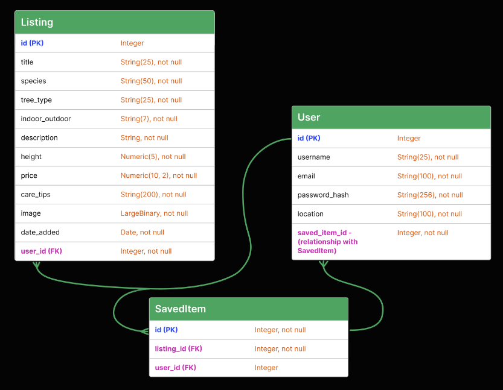

# Bonsai Bay
The purpose of this site is to provide a platform for bonsai enthusiasts, both individuals and businesses, to digitally market their bonsai trees or browse and purchase trees listed on the website. It will feature a relational database designed to store all relevant information necessary for the site's operation.

### [View the live project here](https://bonsai-bay-118c459daa3f.herokuapp.com/)


## Table of Contents
1. [User Experience (UX)](#user-experience-ux)
    - [User Stories](#user-stories)
    - [Site Objectives](#site-objectives)
2. [Design](#design)
    - [Strategy](#strategy)
    - [Scope](#scope)
    - [Structure](#structure)
      - [All Pages](#all-pages)
      - [Homepage](#homepage)
      - [Item Page](#item-page)
      - [Account Page](#account-page)
      - [404 Page](#404-page)
    - [Skeleton](#skeleton)
      - [Table Schema](#table-schema)
      - [Wireframes](#wireframes)

## User Experience (UX)

### User Stories
1. As a user, I would like to access a digital marketplace specifically for the sale and purchase of bonsai trees.
2. As a user, I would like to be able to create an account where I can store my information.
3. As a user, I would like to be able to create and display listings for sale and manage these by amending or deleting.
4. As a user, I would like to view/search for bonsai trees on the site that people would like to sell.
5. As a user, I would like to view information about the product such as; product, description, location etc.
6. As a user, I would like to filter items to refine my search.
7. As a user, I would like to be able to contact the seller.

### Site Objectives
1. To appeal to bonsai enthusiasts and potential bonsai enthusiasts of any age.
2. To be responsive and functional.
3. To meet all accessibility requirements, allowing anyone to use the site regardless of their abilities/needs.
4. To include an appropriate data model for the website, that functions as intended.

## Design
### Strategy 
Taking into account the intended website, I have:

* Conducted research into websites that offer bonsai related services:
  * [Greenwood Bonsai Studio](https://www.bonsai.co.uk/)
  * [Herons Bonsai](https://www.herons.co.uk/)
  * [Bonsai2U](https://bonsai2u.co.uk/)
  * [British Bonsai](https://britishbonsai.co.uk/)<br>
  
  General findings with these sites are:
    * Logo is positioned in the top left. 
    * Most contain a search function.
    * Most have contact details displayed at the top of the page also.
    * The majority tend to white and green as the main colours for the site. In some there is the use of cream and various shades of grey. There is another site that uses red and white as the main colours.
    * All the sites contain the navigation at the top of the page, which generally includes; categories for bonsai trees, links to products or services within the site.
    * All have sections to login/register an account. 
    * All have shopping carts where items can be added to purchase.
    * They contain a banner/main image(s) directly below the navigation, which draw the visitors attention. These contain headers and some contain animations or buttons.
    * All display images of the products through the sites in a grid or various different sizes, these also show the item name and price.
    * When a bonsai tree is clicked this expands to provide more information, such as; species, price,  height, desired location, and general maintenance.
    * Some have additional selling points such as an introduction/reasons to choose them, reviews, testimonials or mention of affiliations with reputable companies.
    * Footers contain links for site navigation, social media, FAQs/help. Also contains contact details.

* Conducted research into digital marketplaces with similar functionality that I would like to achieve within the website:
  * [Gumtree](https://www.gumtree.com/)
  * [Facebook Marketplace](https://www.facebook.com/marketplace/)

  General findings with these sites are:
    * Similar navigation design to the bonsai sites in terms of logo, search function, account register/login.
    * There are also buttons to sell/create a new listing.
    * Also Images of items for sale are displayed as a grid and include; price, item name, location and some have brief descriptions.
    * When an item is clicked this takes you to more information about the item, such as further images or description. It also provides the options to add to saved items, share, or contact the seller.  (messenger, whatsapp or email). There is also a map to display an approximate location.
    * These sites contain ways to filter/refine a search, which is displayed down the left of the page.
    * They have location finding logic and the option to choose other locations.
    * I don’t believe Facebook marketplace has a footer and just seems to continue displaying further items as you scroll down.
    * Gumtree contains a similar footer to that of the bonsai sites, but also contains a link to download their app.

Following on from research, the strategy is to create a website that combines the feel of a bonsai site but with the functionality of a popular digital marketplace. The site should meet all of the expectations from the user stories, site objectives while also considering findings from the research conducted. 

### Scope
I have listed the possible features below and ranked 1-5 in level of importance/relevance to user needs (1 being most important and viable/feasible):

| Possible Feature | Rank |
|---|---|
| Site navigation | 1 |
| Accessibility | 1 |
| Device/resolution responsivity | 1 |
| Responses to user action | 1 |
| Account login and account management | 1 |
| Ability to create, update and delete listings | 1 |
| Location finding | 1 |
| Images of items for sale including relevant information | 1 | 
| Method to contact seller | 1 |
| Ability to save items | 1 |
| 404 page | 1 |
| Introduction with background image | 1 | 
| Ability to choose location | 2 |  
| Search function | 2 |
| Filters to refine search; such as distance, type or price | 2 |
| Ability to navigate by categories | 2 |
| Footer | 3 |
| Logo | 3 |
| Social links | 3 |
| Instant Messenger between buyer and seller | 3 |
| Reviews | 5 | 
| Blog | 5 |  

As some of these features extend beyond the necessary requirements for the project and may take more time than appropriate, I will not will not currently be implementing:
* Instant messenger
* Reviews
* Blog 

### Structure 
I have listed the pages below including the features they will contain. 

#### All pages:
 * Navbar:
  * Logo and site name, clicking on these will reload the home page.
  * Search bar/function. 
  * Location selection.
  * Account button.
 * Navigation by category.
 * Footer:
   * Social media links.
   * Help/Contact Us.
   * Categories.	

#### Homepage:
* Introduction with background image.  
* Images of items for sale including relevant information. 
* Item filters. 
* Save item button. 

#### Item Page:
* Method to contact seller. 
* More information relating to the item.
* Save item button. 

#### Account Page:
* Account details (expands when clicked):
  * Email displayed.
  * Password change.
* Listings button (expands when clicked):
  * Create listings, clicking on this displays a modal for the data entry.
  * Shows listings.
  * View button. 
  * Amend button. 
  * Delete button.
* Saved items button (expands when clicked):
  * Shows saved items. 
  * View button. 
  * Remove button.  

#### 404 page:
* Message displayed confirming user has tried to visit a page in the domain that does not exist.
* Link/button within the page content that will direct the user to the home page.

### Skeleton

#### Table Schema
<br>

* User:<br>
This table stores user details. Each user has a unique id, username, and email. The password_hash stores the hashed password for security. The location field stores the user’s location. The saved_items field is a relationship that links to the SavedItem table.

* Listing:<br> 
This table stores information about listings. Each listing has a unique id and various attributes like title, species, tree_type, indoor_outdoor, description, height, price, care_tips, image, and date_added. The user_id field links to the User table, storing who added the listing.

* SavedItem:<br> 
This table stores information about items saved by users. Each saved item has a unique id. The listing_id and user_id fields link to the Listing and User tables respectively, indicating which user saved which listing.


#### Wireframes

  <details><summary>Homepage</summary>
    
  </details>

  <details><summary>Homepage With Model</summary>
    
  </details>
  
  <details><summary>Item Page</summary>
    
  </details>

  <details><summary>Account Page</summary>
    
  </details>

  <details><summary>404 page</summary>
    
  </details>

>Note; the decision was made to slightly alter the design during developement; some of the wording has been altered and; more fields have been included in the forms. I have also included further modals for checking if they want a listing to be deleted and also a mock message seller form.

### Surface
#### Habits and conventions:
Users will navigate through the site by clicking on the links in the navbar, scrolling down the pages, through clicking on the various buttons and interactive elements within the site.

#### Typography
I have chosen a combination of google fonts “Yeseva One” for the larger headers and “Josefin sans” for the general font. I feel these have a nice style, complement each other nicely, and are clear and readable. 

#### Colour Scheme:
* The colour scheme is relatively simple. I have used white and dark green for the majority of the site (#095D49), this is because I wanted a colour choice that would compliment the bonsai trees well. 
I have also chosen to grey’s (#f7f7f7 + #eeeeee)as well to make some areas subtly standout compared to the background (such as the footer and parts of the accordion)
There is use of a dark red for warning buttons (#5d091d)
* The chosen colour scheme meets the Web Content Accessibility Guidelines for readability.

## Features
### General
* Responsive on all device sizes.
* Meta descriptions included to improve SEO.
* Semantic elements, alt attributes and sr attributes to assist with accessibility/screen readers.
* Connected to a location api (locationiq.com) where data location data is fetched and city is displayed within the site
* All active buttons and anchor tags on the site provide visual responses to hover and click.

### Navbar (displayed on all pages)
#### Site header
* Includes logo and site name
* When clicked with directs to/reloads the homepage
* The site name will disappear on smaller devices sizes

#### Navigation links (displayed on all pages)
* Browse Bonsai:
  * Directs user to specific area where the listings are displayed on the homepage; listing data is pulled from the database.
* Search:
  * When clicked it opens up a search bar and a search icon.
  * Users can then do a keyword search and press the enter key on their keyboard, or the search icon to generate the search. 
  * They are then directed to the specific section in the homepage where these results are displayed
* Account:
  * Initially this will pop up with a model containing two forms (login or register).
  * They contain form validation. 
  * They display colourful alerts to indicate whether a submission has been successful.
  * The registration form contains a location icon that when click will attempt to locate the borrowers city.

### Footer (displayed on all pages)
* Contains social media links for; Facebook, Twitter and Instagram.
* Copyright 2024 is included
* Contains an address for the company, location finder, and contact details

### Homepage
* An introduction message that says ‘Trading Tiny Tree Together’.
* The main image, which is someone holding a bonsai tree out as if passing it to someone as a gift.
* Filter button for filtering search results. This is currently disabled but will be a future implementation.
* Listing header and the individual listings are displayed below, with title, image and price of the listing. 
* Chevrons for left and right to indicate pagination. This is currently disabled but will be a future implementation.

### Item Page:
* An enlarged item card of the listing for better viewing
* Displays details of the listing such as; description, care tips, features, date added, and seller location.
* A ‘Message Seller’ Button:
   * When clicked this displays a modal with a textarea for a message to be typed.
  * A ‘Go Back’ button, which closes the modal when clicked
  * A ‘Send’ button, which when clicked displays a message below the textarea to say ‘Your message has been sent’. The message is currently not stored within the db, however it is intended that a full functional messaging system is set up as a future function.
* A ‘Save Item’ button. When clicked this saves the item to the database which is then displayed in the account page for the specific user that is logged in.
* A ‘Back to Homepage’ button. When clicked it directs the user back to the homepage.

### Account page
* A button to logout, which logs the user out and directs them to the homepage
* A header that displays “(Username)’s Account”; user data is pulled from the database
* An accordion containing:
  * Email + password:
    * When expanded this shows the users email address; user data is pulled from the database.
    * Password is merely a few asterix’s for display purposes, not actually associated with the users password.
    * Edit buttons. These are currently disabled but will be a future implementation.
  * Create New Listing:
    * This contains a form for a number of fields that are appropriate to the listings; text, radio, textarea, image, and number. 
    * These all have form validation based on the expectation from the db model. 
    * A Create Listing button that when clicked adds the listing to the db under the table ‘Listing’. These are then displayed appropriately within the site.
  * Listings:
    * Displays the listings as item cards in a grid that the currently logged in user has created.
    * An edit button under each item card, which opens up a model form that is pre-populated with that particular listing’s information. When clicking ‘Save Changes’, all fields will update accordingly for that listing within the database and across the site.
    * A delete button under each item card, which opens up a model that allows the user to confirm whether they wish to delete the listing or press no to go back. If yes is clicked the listing will be removed from the database and will no longer be displayed throughout the site.
  * Saved Items:
    * Displays listing as item cards in a grid. 
    * When clicked this opens the item page.
    * A remove button; this is currently disabled but will be a future feature.

>Note. the ability to create, read, update and delete can all be done in full within the create listings and listings sections.

## Deployment
The project was deployed as a relational database from [ElephantSQL](https://www.elephantsql.com/) to [Heroku](https://www.heroku.com/) 

### ElephantSQL steps:
* Navigate to [ElephantSQL.com](https://www.elephantsql.com/) and select:
  * ‘Get a managed database today’.
  * Then ‘Try now for FREE’ in the TINY TURTLE database plan.
  * Then ‘Log in with GitHub’ and authorize ElephantSQL with your selected GitHub account.
* In the Create new team form complete the appropriate fields then Click “Create Team”, this should have created your account.
* When in the account select “Create New Instance”.
* Set up your plan:
    * Give your plan the name of your project.
    * Select the Tiny Turtle (Free) plan.
    * Tags can be left blank.
* Select a data centre closest to you; EU-West-1 (Ireland) is the appropriate one for UK based on the options.
* Select ‘Review’.
* Select ‘Create instance’
* The database should now be created.
* Click the database instance name for this project in your dashboard.
* Then copy the url.

### Heroku
* Create a couple of files:
  * `pip3 freeze --local > requirements.txt` to create requirements.txt file (contains the dependencies). 
  * `echo web: python (Your python file that runs the application here) > Procfile` to create the Procfile, Be sure to check the file and contends as there may be a blank line at the end of the line of code, which will need to be removed and then saved.
* Commit these changes to github.
* Login/Sign up to [Heroku.com](https://www.heroku.com).
* Click ‘create new app’.
* Provide your app name (must be unique) and select a region.
* Click ‘create app’.
* Connect the Heroku app to the GitHub repository by selecting GitHub in the deployment section, and then finding the specific repository.

* Once connected, config variables need to be included to build the app. 
   * Click on the settings tab.
   * Then reveal config vars button. 
   * Enter the environment key/value variables from your env.py file, should look something like the below:<br>.
IP : 0.0.0.0<br> 
PORT : 5000<br>
SECRET_KEY : ENTER_YOUR_SECRET_KEY_HERE<br>
DATABASE_URL : ENTER_THE_URL_CREATED_IN_ELEPHANTSQL<br>
DEBUG : TRUE<br>
>Note, if you have any other environment variables, be sure to include these also.
* Paste your URL from ElephantSQL in this section.
* Click on ‘automatic deploys’ and the ‘create button’, Heroku will the start building the app.
* Select ‘More’ at the top of the page and then ‘run console’. 
* Type python3 in the console, then run the below:
  * from (enter your project package name here) import db.
  * db.create_all()... This should hopefully build your database.
  * Then you are free to exit the terminal.
  * Click on ‘Open app’ at the top of the dashboard, which should open your deployed webpage with Heroku in a new tab.

### Forking a GitHub Repository
This means making a copy of the original repository on a GitHub account, for the purpose of viewing/making changes to it but without affecting the original repository. Steps for this are below:
* Go to the GitHub repository.
* Click on Fork button in the upper right hand corner.

### Cloning the repository is possible by following these steps:
* Go to the GitHub repository. 
* Locate the Code button above the list of files and select. 
* Select if you prefer to clone using HTTPS, SSH, or Github CLI and click the copy button to copy the URL to your clipboard.
* Open Git Bash.
* Change the current working directory to the one where you want the cloned directory.
* Type git clone and paste the URL from the clipboard ```$ git clone https://github.com/YOUR-USERNAME/YOUR-REPOSITORY```.
7.Press Enter to create your local clone.

## Technologies Used

### Languages Used

-   [HTML5](https://en.wikipedia.org/wiki/HTML5)
-   [CSS3](https://en.wikipedia.org/wiki/Cascading_Style_Sheets)
-   [JavaScript](https://en.wikipedia.org/wiki/JavaScript)
-   [JQuery](https://en.wikipedia.org/wiki/JQuery)
-   [Flask](https://en.wikipedia.org/wiki/Flask_(web_framework))
-   [SQLAlchemy](https://en.wikipedia.org/wiki/SQLAlchemy)
-   [PostgresSQL](https://en.wikipedia.org/wiki/PostgreSQL)

### Frameworks, Libraries & Programs Used

* [Bootstrap 5.3.3:](https://getbootstrap.com/docs/5.3/getting-started/introduction/)
    - Bootstrap was used to assist with the responsiveness of all pages.
* [Font Awesome:](https://fontawesome.com/)
    - Font Awesome was used on the social media links in the footer and a search icon for the search bar.
* [Google Fonts:](https://fonts.google.com/)
    - Google fonts were used to import the chosen fonts that were used throughout the webpages.    
* [Git](https://git-scm.com/)
    - Git was used for version control to commit to Git and Push to GitHub.
* [GitHub:](https://github.com/)
    - GitHub is used to store the project’s code after being pushed from Git.
* [Visual Studio Code](https://code.visualstudio.com/)
    - Visual Studio Code was used as the IDE for the project.
* [Figma](https://www.figma.com/login?is_not_gen_0=true) 
    - Figma was used to complete further wireframes for mobile, tablet and desktop pages. Also the database table schema.
* [Designer(Microsoft Copilot)](https://designer.microsoft.com/) 
    - Designer was used to create the logo and the main image of a bonsai being held.

# Code 
### Templates 
*  [Bootstrap Library](https://getbootstrap.com/docs/5.3/getting-started/introduction/ "link to Bootstrap Docs"):
    * Has been used through the project to assist with making the pages responsive. 
    * I have used some template code from Bootstrap documentation, such as the form, modals, accordion and navbar.
    * I have made amendments to these in order to suit the chosen design for the website.

## Acknowledgements 
* Mitko Bachvarov - My Code Institute Mentor for helpful feedback.

* Adam Cross - Course Curriculum manager at Code Institute for their support

* Paul Bowers - My Course tutor for their useful tutorial sessions, in particular guidance around creating a search function.

* Laura Gibbons - My partner for her user feedback 

* Aaron Smyth - for his user feedback on Safari browser 
