# Testing

I have considered the testing approaches for this project; automated versus manual.

I believe automated testing works well when tests would take a very long time to do manually, or if tests need to be repeated over and over again. 
I believe that manual testing can be better when you only need to run a test a couple of times.

For this project, I have used manual testing throughout development and post development so that I can take a hands-on approach and ensure everything works smoothly.

## Validation 
### WSC - Markup Validation Service
* Homepage (including base.html and index.html):
  * Error = button type attribute not allowed on div. Fixed this my changing the attribute to role=”button”.
  * Warning = aria-label not valid for twitter `<i>` element, corrected this by moving the aria-labels to the containing `<a>` element instead.
  * After these changes, no errors or warnings displayed.

* Browse bonsai:
No errors or warnings displayed.

* 404 page:
  * No errors or warnings displayed.

* Account page:
  * Error = HTTP resource not retrievable (401). This is due to the authentication required before the account page can be accessed. Fixed this by adding logic to the account route that handled the absence of a user being logged in. Also temporarily commented out login_required so that the template could run through the validator.
  * Error = Duplicate id ‘email’ one in base template and one in account template, fixed by renaming the if in account template as well as the relevant data-bs-target.
  * Warning = Min and max attributes not allowed in textarea (x2), I have removed these.
  * Warning  = Accidentally included `]`  as an attribute within a textarea, fixed by removing this.
  * After these changes, no errors or warnings displayed.

* Item page: 
  * No errors or warnings to show.

### WSC - CSS Validation Service
I have entered my external css file into the validator:
* No errors found.
* Warnings appear in relation to using variables for the colours/fonts. I have left these in as css variables were taught in one of the codeinstitute lessons.

### Wave - Web Accessible Evaluation Tool
* Error = Search-bar input didn't have a corresponding label, I have added this now but made sure it is visually hidden.
* Error = 2x buttons that were empty, I have changed these elements to divs. These are currently just for display purposes, as functionality will be in future implimentations.
* Error = 1x button said to be empty, although has an icon as the value. I have fixed this by adding an aria-label for screen readers.
* Warning = Missing first level headings, changed `<h2>` to`< h1>` and `<h3>` to `<h2>`.
* Warning = Skipped level heading, referring to the `<h6>` tags for the listing titles, fixed these by changing to `<h4>` tags.
* Warning = redundant link as there is more than one link for home on the navbar, this was on the logo and the site name which are next to each other. Fixed by combining into one anchor tag.
* Warning = Redundant links for ‘Browse Bonsai’ as there is a link for this in the navbar and a link below the intro message on the main page. I have left this in as believe it is a key part in the design. This only happens on the homepage.

### JSLint
All of my JavaScript for this project has been put through JSLint.
A common warning appears in reference to ‘document’ not being declared throughout JavaScript code. <br>These warnings are unnecessary and I have removed them when using the linter by adding
``` /*jslint browser:true */``` to the top of the page.<br>
Details of the JSLint results for each page can be seen below:

#### Location.js:
* Warning = Regarding undeclared 'fetch'. Have resolved by placing /*global fetch */ to make jslint aware that this is intentionally used.
* Warning = To use double quotes instead of single quotes within functions. Fixed by amending these.
* Warning = Expected use of ‘await’ as ‘async’ was used. Looking at the function I noticed that there was no need to have async on the outer function as there is a async - await logic within an inner function. Removed async from the outer function.
* Warning = Line of code of 80 characters long. I have resolved this by splitting this over 2 lines.
* Warning = JSlint didn’t like this line ‘if ("geolocation" in navigator)’, suggested that I Compare with undefined, or use the hasOwnProperty method instead. I have amended the function to compare with undefined; function still works as desired after the amendment.
* Warning = About a line of code that isn’t in my files at all (eval("console.log(\"hello world\");");. I have used the magnifying glass search to try and locate this, have also searched to see if it is contained within a module; it isn’t. I can only assume this must be an error with JSlint.
* Functionality still works as expected after these changes

#### Login.js:
* Warning  = Unexpected trailing space. Fixed by removing this
* Warning = JSlint didn’t like a couple of arrow functions having complexity. I have fixed these by changing to a traditional function
* Warning = A few lines longer than 80 characters. Fixed these by splitting into two lines
* Warning = Undeclared Jquery symbol. Added JQuery symbol the same comment as global fetch in order to pass JSlint
* Warning = Suggested double quotes be used instead of single quotes inside functions. Fixed by amending these.
* Warning = Expected property 'body' to be ordered before property 'method'. Fixed by swapping them around
* Warning = Post method is unexpected. The logic to handle this method is server side so I have not made any amendments to this.
* Functionality still works as expected after these changes

#### Register.js:
* Warning = Expected property 'body' to be ordered before property 'method'. Fixed by swapping them around
* Warning = Post method is unexpected. The logic to handle this method is server side so I have not made any amendments to this.
* Warning = A few lines longer than 80 characters. Fixed these by either splitting into two lines, or reducing comment size.
* Warning = JSlint didn’t like a couple of arrow functions having complexity. I have fixed these by changing to a traditional function 
* Warning = Some lines with trailing spaces. Fixed by removing these
* Warning = Suggested double quotes be used instead of single quotes inside functions. Fixed by amending these.
* Functionality still works as expected after these changes

#### Search.js:
* Warning = A couple of line longer than 80 characters. Fixed these by either splitting into two or more lines.
* Warning = Some lines with trailing spaces. Fixed by removing these
* Warning = Suggested double quotes be used instead of single quotes inside functions. Fixed by amending these.
* Warning = Expected closing brace and instead saw backtick. There are no problems in the terminal and function works are expected. I can only assume JSLint seems to be having issues with backticks as were not previously supported.
* Functionality still works as expected after these changes.

### CI Python Lynter:
#### __init__.py:
* A couple of lines longer than 80 characters. Fixed by reducing the amount of words used.
* No new line space at the end of the file. Fixed by adding a newline at the end.
* Module level import not at top of file; referring to `from bonsai_bay import routes`. This position is required for the app to function correctly, so I am leaving this where it is.

#### Models.py: 
* No errors found or amendments needed.

#### Routes.py:
* Quite a few of lines longer than 80 characters. Fixed by reducing the amount of words used or splitting over two/three lines, sometimes using `\` to show it is a continuation of the same line
* Blank line contained a whitespace. Fixed by removing this.

#### App.py:
* No errors found or amendments needed.

#### Env.py:
* One line longer than 80 characters. Fixed this by splitting across 3 lines.

## Manual Testing 
General Responsiveness Test:
* Test: Check the website on different device sizes and resolutions.
* Expected: The website should be responsive on all device sizes and resolutions.
* Result: Pass.

Location API Test:
* Test: Check if the city is displayed within the site.
* Expected: The website should be connected to a location API (locationiq.com) where location data is fetched and city is displayed within the site.
* Result: Pass for all except on the ipad (Safari), nothing seems to happen when the location icon was clicked.<br>
I did also run into some temporary issues, that hasn’t happened until testing and is now working fine on all browsers (except Safari). The issues were:
  * Location not found when trying on desktop.
  * Incorrect location picked up when using edge.
<br>**I believe this must be to do with the specific API that I’m using, and will potentially look into an alternative choice should this continue to happen in the future.**

Active Buttons and Anchor Tags Test:
* Test: Hover and click on all active buttons and anchor tags on the site.
* Expected: All active buttons and anchor tags on the site should provide visual responses to hover and click.
* Result: Pass.

Navbar Test:
* Test: Click on the logo and site name in the navbar.
* Expected: It should direct to/reload the homepage.
* Result: Pass.

Site Name Display Test:
* Test: Check the site name on smaller device sizes.
* Expected: The site name should disappear on smaller device sizes.
* Result: Pass.

Browse Bonsai links Test:
* Test: Click on the ‘Browse Bonsai’ links under the introduction message and within the navbar.
* Expected: ‘Browse Bonsai’ should scroll the view down to where the listings are displayed on the homepage.
* Result: Pass.

Search Links Test:
* Test: Click on the ‘Search’ link.
* Expected:  ‘Search’ should open up a search bar and a search icon.
* Result: Pass.

Search Function Test:
* Test: Type in various search queries then press enter on the keyboard and with the search icon.
* Expected:  It should scroll the page down to where the listings are. There should only be results displayed that meet the search query. If not results, it should display a dynamic message confirming ‘No results found for (query)’.
* Result: Pass.

Account Link Test (not logged in):
* Test: Click on the ‘Account’ link in the navbar and fill in the login or register forms.
* Expected: Initially this will pop up with a model containing two forms (login or register). They should contain form validation and display colourful alerts to indicate whether a submission has been successful.
* Result: Pass.

Account Link Test (logged in):
* Test: Click on the ‘Account’ link in the navbar.
* Expected: This should redirect the user to their account page.
* Result: Pass.

Login Form Test:
* Test: Type into all fields and click on ‘Login’.
* Expected: It should let you know if input does not meet validation requirements. When ‘Login’ is clicked the user should be added to the database. A message should be displayed to confirm if login was successful or unsuccessful. If successful the user should be directed to their account page. 
* Result: Pass.

Registration Form Test:
* Test: Type into all fields and click on ‘Register’ .
* Expected: It should let you know if input does not meet validation requirements, it should attempt to find a location (City) when the location icon is clicked. When ‘Register’ is clicked the user should be added to the database. A message should be displayed to confirm if registration was successful or unsuccessful. 
* Result: Pass.

Footer Test:
* Test: Check the footer for social media links, copyright, address for the company, location finder, and contact details.
* Expected: The footer should contain social media links for Facebook, Twitter and Instagram. Copyright 2024 should be included. It should contain an address for the company, location link. and contact details. The location link should direct the user to an address in google maps.
* Result: Pass.

Item Page Test:
* Test: Check information is displayed correctly.
* Expected: It should display the specific details of the listing such as; description, care tips, features, date added, image, title, price and seller location. And ‘Back to Homepage’ should direct the user back to the homepage.
* Result: Pass.

Message Seller button:
* Test: Check message seller button functionality.
* Expected: When click a model should appear with a text area for a message to be typed, a ‘Go Back’ button that closes the modal, and a ‘Send’ button that displays a message to say ‘Your message has been sent.
* Result: Pass.

Save Item Button:
* Test: Check save item button functionality.
* Expected: When clicked that particular item should be added to the users account page under saved items.
* Result: Pass.

Account Page Test:
* Test: Check the account page displays relevant user data in the appropriate fields.
* Expected: The account page should contain a button to logout. It should display a header that displays “(Username)’s Account”. It should contain an accordion containing ‘Email + password’, ‘Create New Listing’, ‘Listings’, and ‘Saved Items’. Listings and saved items should display item cards of the appropriate listings.
* Result: Pass.

Create Listing Test:
* Test: Check create listing form within functions correctly.
* Expected: The form should require all fields to be completed and also let the user know if input is invalid. When ‘Create Listing’ is clicked, a listing should be added to the database for that user, then displayed in the listings section in the users account and in listings section on the home page.
* Result: Pass.

Edit Listing Test:
* Test: Check edit listing functions correctly.
* Expected: When ‘Edit’ is clicked, a modal form should appear that is pre-populated with the listing information. The form should require all fields to be completed and also let the user know if input is invalid. When ‘Save Change’ is clicked it should update the details of the listing in the database, then these changes should be reflected throughout the site.
* Result: Pass.

Delete Listing Test:
* Test: Check delete listing functions correctly.
* Expected: When ‘Delete’ is clicked, a modal should appear which ask the user ‘Are you sure you want to delete this listing?’ There should be buttons for No and Yes which work appropriately.
* Result: Pass.

Saved Items Test:
* Test: Check the saved item cards are displayed and function corrected.
* Expected: The saved items card should display, when clicked this should load the item page for that listing displaying the relevant details.
* Result: Pass.

## Testing User Stories 
### As a user, I would like to access a digital marketplace specifically for the sale and purchase of bonsai trees.<br>
Result = Pass<br>
<details><summary>Homepage screenshot</summary>
    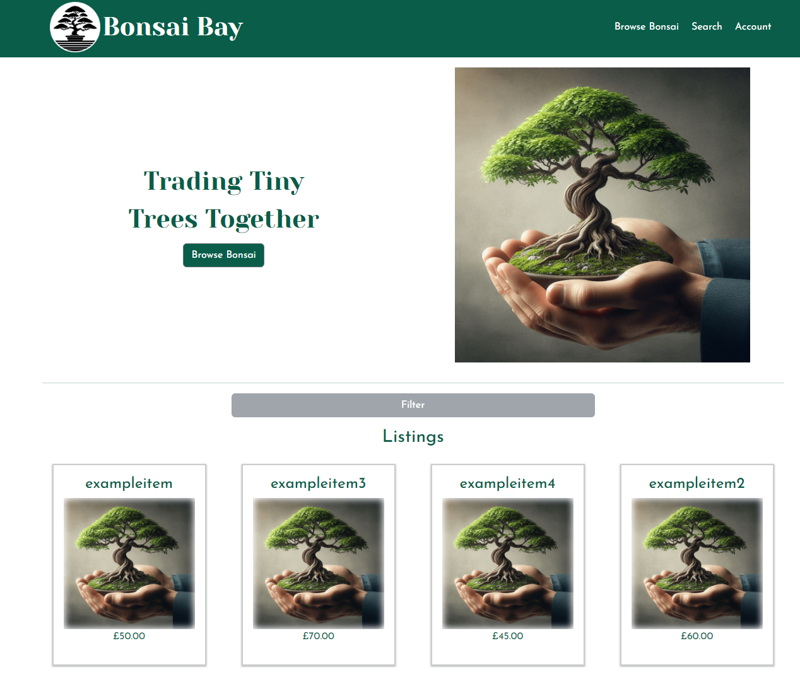
</details>

### As a user, I would like to be able to create an account where I can store my information.<br>
Result = Pass<br>
<details><summary>Login/register modal</summary>
    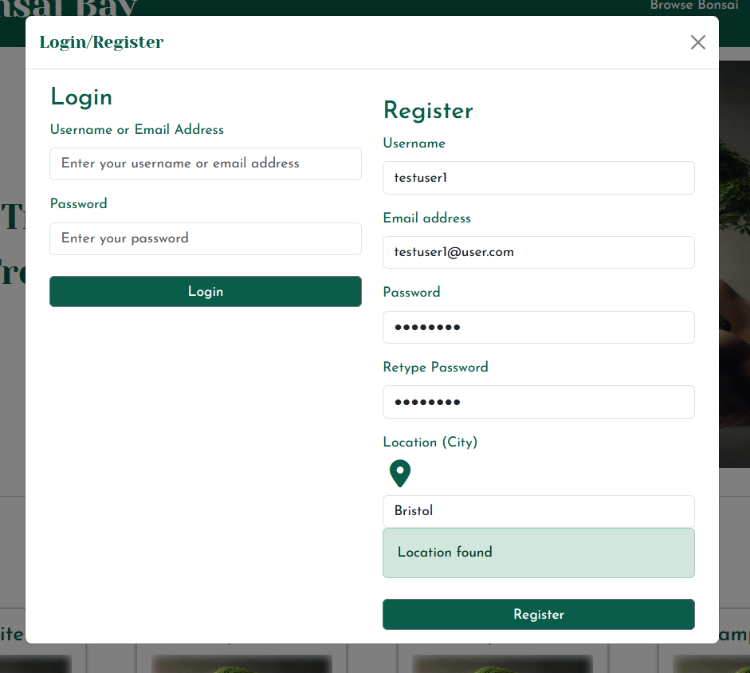
</details>

<details><summary>Account page displaying user information</summary>
    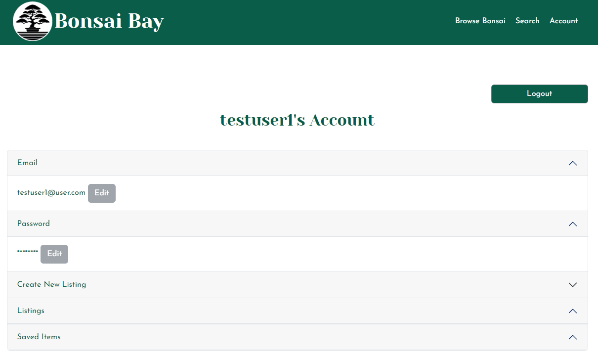
</details>

### As a user, I would like to be able to create and display listings for sale and manage these by amending or deleting.<br>
Result = Pass<br>
<details><summary>Create listing form</summary>
    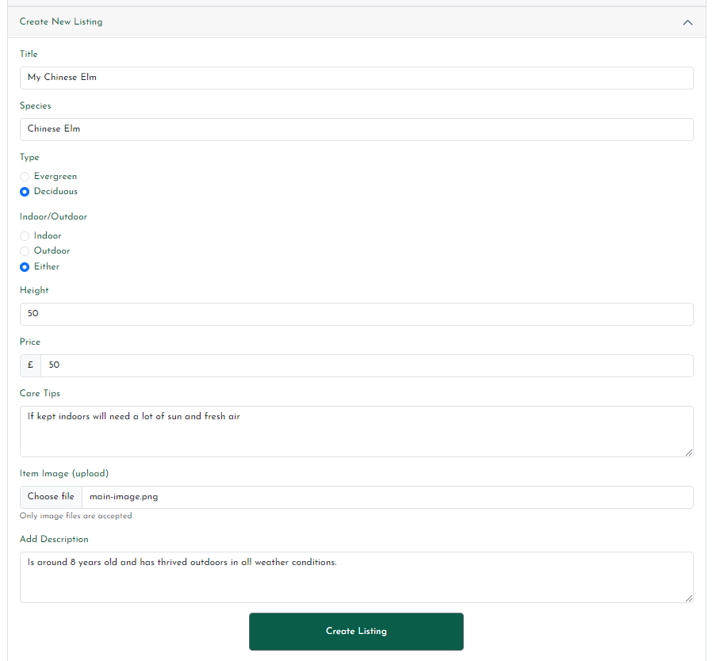
</details>
<details><summary>Created listing displayed</summary>
    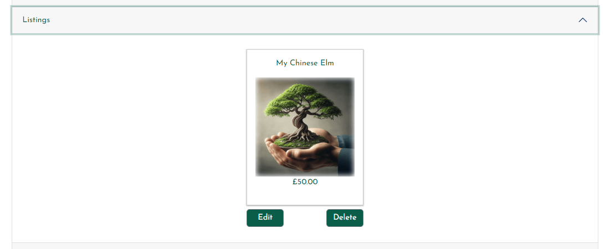
</details>
<details><summary>Edit Listing form (prepopulated)</summary>
    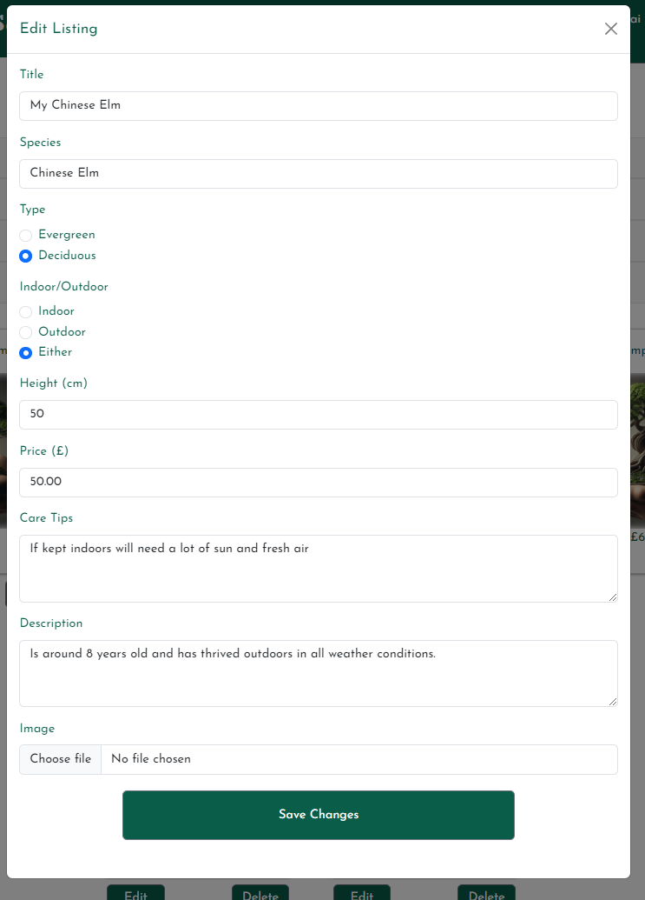
</details>
<details><summary>Delete listing modal</summary>
    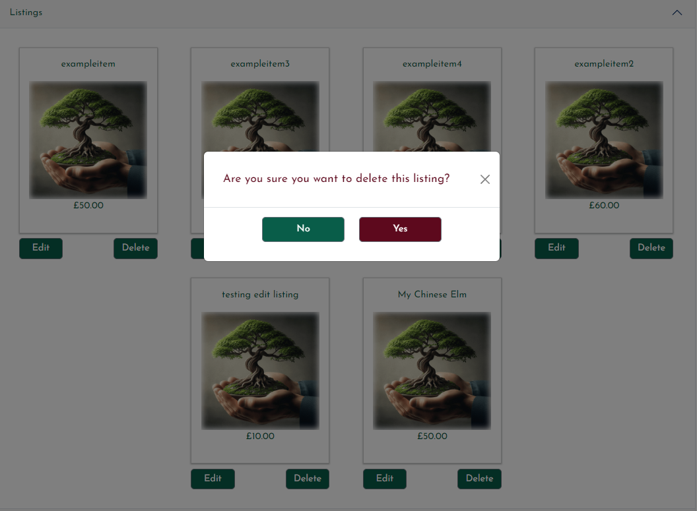
</details>

### As a user, I would like to view/search for bonsai trees on the site that people would like to sell.<br>
Result = Pass<br>
<details><summary>Results displayed from search function</summary>
    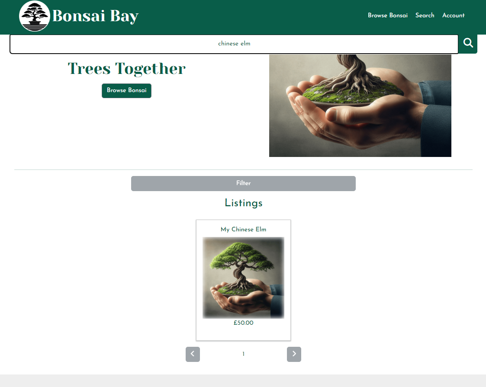
</details>

### As a user, I would like to view information about the product such as; product, description, location etc.<br>
Result = Pass<br>
<details><summary>Item page displaying information about the listing</summary>
    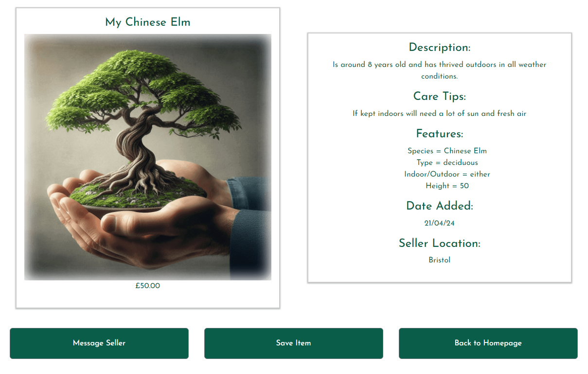
</details>

### As a user, I would like to filter items to refine my search.<br>
Result = Fail: This has not currently been implemented but will be as a future feature, the filter does appear on the web page for display purposes. <br>
<details><summary>Filter button</summary>
    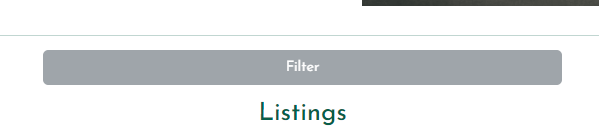
</details>

### As a user, I would like to be able to contact the seller.<br>
Result = Fail: There is currently functionality which has the appearance of a message being sent. However the seller does not receive this message and it isn’t stored within the database. This will be included as a future feature.<br>
<details><summary>Message modal to contact the seller</summary>
    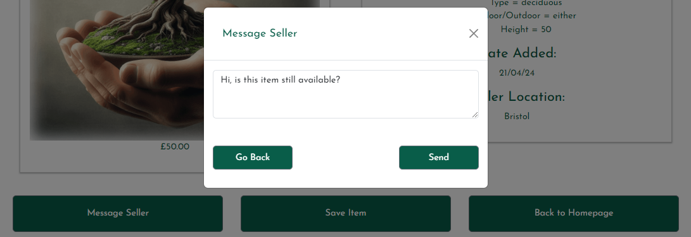
</details>

## Other Testing
Google Developer tools:
* I have continuously tested and played around with many different resolutions throughout developement, to ensure there is no unexpected behaviour.

Testing on other browsers:
* Google Chrome.
* Microsoft Edge.
* Firefox.
* Safari (didn't work as intended)

Devices:
* Google Pixel.
* Samsung S10.
* Ipad
* Dell Inspiron (Windows 11).
* Lenovo laptop

Other users:
* My friend Aaron Smyth has tested the site on his Apple laptop in the Safari browser (didn't work as intended, see unresolved bugs)
* My partner Laura Gibbons has tested the site herself on different browsers on her Google Pixel.

## Bugs:
Flask migrations:
* Bug = After removing the seller table from the database model, it would not allow the flask migration to take place. It was flagging up that it there were dependant objects so it was not possible to drop the listing_seller_id_fkey
* Outcome = I tried dropping this manually by using sql commands that I had found, however this did not resolve the issue. I was able to locate some information about editing the migration script directly. I made the appropriate amendments and the migration was successful following this.

Images:
* Bug = Instead of an image being displayed, I was getting a long string of what appeared to random character.
* Outcome = Fixed by including image encoding with the route, and passing in the encoded image into the relevant template

SearchListings function:
* Bug = I had initially set up the function to only search by listing title, there are many other categories for the listed items so this was really limiting the accuracy
* Outcome = I updated the results_list to include the other listing data that I wanted to be displayed, encoded the image and then update my javascript code to display the details.

Account navigation button:
* Bug = Each time the account link was clicked it would pop up with a model asking for the user to login or register, even if the user is already logged in.
* Outcome = Fixed by adding a route to check whether there is a user currently logged in then return a response to confirm, and created JS/Jquery functionality to redirect user to their account page if logged in.

Delete listing button:
* Bug = When the delete button was clicked I noticed this wasn’t deleting the intended listing.
* Outcome = Fixed this by passing the listing.id into a data-bs-target attribute within the model and updated the id to match this attribute.

Storing API key:
* Bug = The location function was working perfectly with the API passed in, however when this key was stored in a variable in another folder then passed into the location function it didn’t work and was displaying errors. 
* Outcome = Managed to get this working by creating a route called get_city to handle the API key and keep it server side, then return the relevant data to client side. To be used within the determineCity function. 

Form handling:
* Bug = If a form field was not completed in the create listing form or edit listing form, an error would occur when trying to submit.
* Outcome = Managed to fix this error by ensuring the `required`; attribute was included within all of the relevant form fields

Account route:
* Bug = When trying to access the account url directly when the user wasn’t logged in, this would display an error message saying unauthorised.
* Outcome = Managed to fix this error by changing the route so that it redirects the user to the home page if not logged.

Save item button:
* Bug = When trying to save an item when the user wasn’t logged in, this would display an error saying unauthorised.
* Outcome = Fixed this by adding a Flask if else statement to disable the save item button if a user isn’t logged in.

Debug status:
* Bug = Even though I had ensured debug was set to False within the production environment, it was still displaying errors that would suggest debug was still on. 
* Outcome = I believe this was due to python interpreting “False” as True, due to the a value being enclosed within quotes (doesn’t work without the quotes). Fixed this issue by amending the app.py script so this carried out a check to see if debug status is True; which would set to False if not the case.

Creating the database with Heroku:
* Bug = When trying to import the database this was encountering an error relation to sqlalchemy being unable to create an engine.
* Attempts to fix:
    * Logging into Heroku CLI and checked the logs.
    * Tried installing psycopg-binary.
    * Reinstalled Psycopg. 
    * Tried cloning this and running the commands through Gitpod instead as assumed maybe there was a set up issue with my VSCode however no luck with any of  these. 
   * Requests had been previously imported but I hadn’t included this within my requirements.txt file, this stopped the particular error from appearings and I was able to progress passed the initial import db command.
* Second bug = Runtime error appeared when running `db.create_all()`, suggesting that I am trying to perform an operation that requires an application context.
* Outcome = Added `with app.app_context():` before `db.create_all()`. This allowed the database including all tables and columns to be created successfully.

Validating the account page with W3C:
* Bug = The page was returning a 401 error meaning authentication is required.
* Outcome = Fixed by adding additional logic within the flask route to handle when a user is not authenticated; adding empty lists for the various fields. This allowed it to be through the validator.

## Unresolved Bugs:
LocationIQ API accuracy:
* Bug = Location API is not always able to pick up a location.
* Outcome = I may consider implementing a different API should this issue continue going forward.

Safari browser compatibility:
* Bug = When clicking on the location icon nothing happens, it doesn’t appear to be trying to access the location.
* Outcome = Will look to implement working functionality in the future.

Remove button for saved items: 
* Bug = Nothing would happen when clicking on the button to remove.
* Outcome = I had followed a very similar method to the delete_listings route (which works as intended), however I was unable to figure out why this approach was not working with the route to remove a saved item. I had made a few tweaks but unfortunately was unable to resolve. I hadn’t been left with much time before due to having various other set backs with the project, the decision was made to leave out this functionality for now, with a view to implement this as a future feature.
